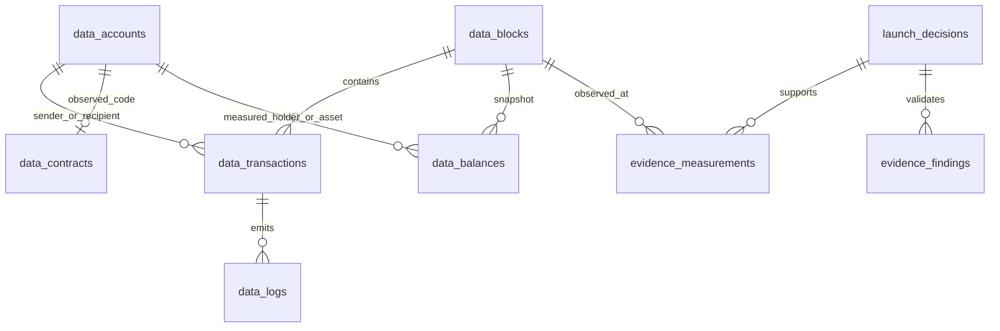

# Blockchain evidence schema v1

Cointrade uses SQLite with foreign keys and WAL. The additive schema indexes records already collected by the live scanner and archive workers. It does not claim full-chain coverage or complete wallet history. No identity credentials or metaverse authentication are involved.



| Table | Meaning and limits |
|---|---|
| `data_blocks` | Chain 4663, height and hash; parent hash and time only when supplied. Log-derived records are explicitly distinguished from headers. Conflicting identities stop indexing without advancing the affected backfill cursor. |
| `data_transactions` | Block foreign key, transaction index, sender/recipient, receipt status and gas quantities. Receipt gas fee uses exact integer multiplication and **excludes any separately charged L1 fee**. Native transaction value remains NULL until independently collected. Log-only transactions have NULL receipt fields. |
| `data_accounts` | Observed addresses. Contract status is recorded only with runtime code and its observation height. Unknown classification remains NULL; a transaction sender is not assumed to be an EOA. |
| `data_contracts` | Observed runtime bytecode and SHA-256, observation height, separate published-source status/provider/time, and available ABI. Source matching does not prove safe admin permissions. |
| `data_logs` | Foreign key to transaction, emitting account, event index/type, SHA-256 of the immutable raw log. Original raw records remain in `chain_events`. |
| `data_balances` | Positive ERC20 balances at an exact block hash. Transfer reconstruction must reconcile totalSupply and every balanceOf read. Atomic amounts are decimal TEXT to avoid rounding. No fabricated native balances or complete historical balance coverage. |
| `evidence_measurements` | Foreign key to the saved decision; metric ID, schema version, value, status, reason, provider, observation time, block reference, unit and scope. Invalid contracts produce findings but no typed measurement rows. |
| `evidence_findings` | Typed validation findings and measurement references. Recorded findings are immutable; dashboard freshness is recomputed at read time. |
| `evidence_refresh_requests` | Deduplicated token/action requests, requester, attempt count and result. Three extra attempts per token/action, at least five minutes apart. Normal periodic collection continues independently. |
| `data_sync` | Resumable raw-log and receipt backfill cursors, errors and update times. Processing is limited to 500 records per source per cycle. |

## Evidence rules

The exported contract is [evidence-v1.schema.json](evidence-v1.schema.json). `cointrade.evidence.validate` also enforces semantic rules that JSON field types cannot establish:

- Unavailable values are NULL. Zero is a measurement, not a missing-data substitute.
- Zero LP supply makes burned fraction **undefined**, not zero percent. V3/V4 pools mark V2 LP quantities **not applicable**; their position ownership and withdrawal protection remain separate unresolved checks.
- Buyer coverage is reviewed / observed transactions; reviewed + pending must equal total. Pending or ambiguous transactions make verified buyer counts **partial lower bounds**. No observations gives undefined coverage.
- Raw top-ten concentration includes pool and custody accounts. Adjusted concentration stays unknown without classification evidence.
- Every measured value has a provider and observation timestamp. Chain observations retain their own block reference. Provider flags may lack a block reference and are labelled accordingly.
- Quotes, holder balances, liquidity, simulated results and wallet signals must be fresh under the configured snapshot limit (120 seconds by default). Published-source checks have a one-hour freshness limit. Stale measurements earn no score; critical freshness and validation failures block entries.
- A passed buy/sell simulation is limited to its account, amount and block. It does not clear unrelated admin controls or rewrite an unknown provider classification.

Old assessments remain unchanged. The UI adapts them for display without inventing missing observation timestamps. Saved scores describe the original assessment time; the evidence ledger shows freshness now.

## Astra and refreshes

Astra High continues through the signed-in Codex subscription. Reviews receive the evidence contract, current validation findings and configured limits. Output includes typed findings with allowed codes, supplied measurement IDs and a fixed enum of read-only collector actions. Arbitrary actions and nonexistent references are rejected.

Before reviewing stale evidence, the worker can request a refresh and wait at most 90 seconds. It then reviews available evidence and explicitly retains unresolved gaps. Findings can request market, holder, source, permission or bounded recent-buyer refreshes. Refresh failure never converts unknown evidence into a pass. Historical FIFO wallet accounting remains separate from the recent-buyer collector.

The terminal's **Safety evidence → Evidence ledger** shows relational coverage, freshness, sources, block links and refresh outcomes. Paper entry still requires deterministic risk checks plus a matching, fresh Astra approval. Exits retain their existing independent rules. No signing or transaction broadcast is added.

## Useful read-only queries

```sql
-- Every measurement supporting one saved decision.
SELECT metric_id,value_json,status,source,observed_at,block_number,block_hash
FROM evidence_measurements WHERE decision_id = :id;

-- Verified holder observations at a selected block, amounts kept as TEXT.
SELECT address,amount_atomic FROM data_balances
WHERE token = :token AND block_hash = :block_hash;

-- Missing receipt coverage is distinct from no transactions.
SELECT receipt_available,COUNT(*) FROM data_transactions GROUP BY receipt_available;

-- Integrity across the relational tables.
PRAGMA foreign_key_check;
```
